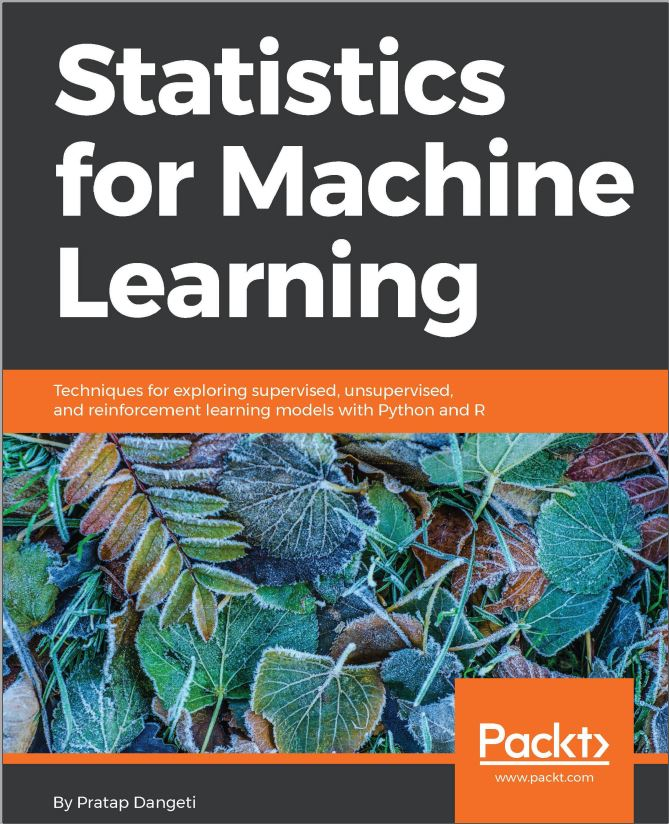

## Statistics_for_Machine_Learning

This repository does contain the codes for the book `Statistics for Machine Learning` book.

Every code snippet was written in both `Python` and `R` programming for ease.

You can purchase the book from [Packt publishing](https://www.packtpub.com/big-data-and-business-intelligence/statistics-machine-learning) or [Amazon](https://www.amazon.in/Statistics-Machine-Learning-Pratap-Dangeti/dp/1788295757)


	


```
Table of Contents

1. JOURNEY FROM STATISTICS TO MACHINE LEARNING

2. PARALLELISM OF STATISTICS AND MACHINE LEARNING

3. LOGISTIC REGRESSION VERSUS RANDOM FOREST

4. TREE-BASED MACHINE LEARNING MODELS

5. K-NEAREST NEIGHBORS AND NAIVE BAYES

6. SUPPORT VECTOR MACHINES AND NEURAL NETWORKS

7. RECOMMENDATION ENGINES

8. UNSUPERVISED LEARNING

9. REINFORCEMENT LEARNING

```
